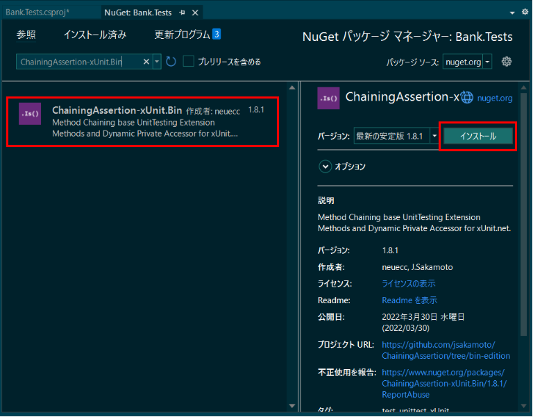

# ユニットテスト
VisualStudioを使用したユニットテストの方法を説明します。

- [ユニットテスト](#ユニットテスト)
- [前提](#前提)
- [手順](#手順)
- [1. テストするプロジェクトを作成する](#1-テストするプロジェクトを作成する)
- [2. 単体テストプロジェクトを作成する](#2-単体テストプロジェクトを作成する)
- [3. テストプロジェクトにテスト対象プロジェクトへの参照を追加する](#3-テストプロジェクトにテスト対象プロジェクトへの参照を追加する)
- [4. テストサポートライブラリを追加する](#4-テストサポートライブラリを追加する)
- [5. テストクラスを作成する](#5-テストクラスを作成する)
- [6. テストを実行する](#6-テストを実行する)
- [参考](#参考)
- [その他](#その他)

# 前提
- Visual Studio 2022
- .NET 6
- xUnit

# 手順
1. テストするプロジェクトを作成する
2. 単体テストプロジェクトを作成する
3. テストプロジェクトにテスト対象プロジェクトへの参照を追加する
4. テストサポートライブラリを追加する
5. テストクラスを作成する
6. テストを実行する


# 1. テストするプロジェクトを作成する
1. Visual Studioを開きます。
2. スタートウィンドウで、**新しいプロジェクトの作成**を選択します。
3. C#**コンソール アプリ**プロジェクト テンプレートを検索して選択し、**次へ** をクリックします。


4. プロジェクトに「Bank」という名前を設定してから、**次へ**をクリックします。推奨されるターゲットフレームワークまたは.NET 6.0 を選択し、**作成**を選択します。**Bank**プロジェクトが作成されます。
5. ソリューションエクスプローラにて、Bankプロジェクトに**BankAccount**クラスを追加します。


6. **BankAccount.cs**ファイルのコードを次のように編集します。

```csharp
namespace Bank
{
    public class BankAccount
    {
        public string CustomerName { get; }

        public int Balance => this._balance;
        private int _balance;

        public BankAccount(
            string costomerName,
            int balance)
        {
            this.CustomerName = costomerName;
            this._balance = balance;
        }

        public void Debit(int amount)
        {
            if (amount > this.Balance)
            {
                throw new ArgumentOutOfRangeException(nameof(amount));
            }

            if (amount < 0)
            {
                throw new ArgumentOutOfRangeException(nameof(amount));
            }

            this._balance -= amount;
        }

        public void Credit(int amount)
        {
            if (amount < 0)
            {
                throw new ArgumentOutOfRangeException(nameof(amount));
            }

            this._balance += amount;
        }
    }
}
```

7. **Program.cs**ファイルのコードを次のように編集します。
```csharp
using Bank;

var bankaccount = new BankAccount("Yuzuhiko", 11);

bankaccount.Credit(5);
bankaccount.Debit(11);
Console.WriteLine($"{bankaccount.CustomerName}さんの現在の残高は、{bankaccount.Balance}");
```

8. メニューの**デバッグ**から、**デバッグの開始**をクリックします。次のように実行されます。
```cmd
Yuzuhikoさんの現在の残高は、27
```


これでテストできるプロジェクトとメソッドを用意できました。

# 2. 単体テストプロジェクトを作成する
1. ソリューションエクスプローラでソリューションを右クリックし、**追加**>**新しいプロジェクト**の順に選択します。
2. C# **xUnit テスト プロジェクト** テンプレートを検索して選択し、**次へ** をクリックします。


3. プロジェクトに「Bank.Tests」という名前を設定してから、**次へ**をクリックします。推奨されるターゲットフレームワークまたは.NET 6.0 を選択し、**作成**を選択します。**Bank.Tests**プロジェクトがソリューションに追加されます。


# 3. テストプロジェクトにテスト対象プロジェクトへの参照を追加する
1. Bank.Testsプロジェクトで、Bankプロジェクトへの参照を追加します。
2. ソリューションエクスプローラーで、Bank.Testsプロジェクトの**依存関係**を選択し、右クリックメニューの**プロジェクト参照の追加**を選択します。
3. **参照マネージャー**ダイアログボックスで、**プロジェクト**を展開し、**ソリューション**を選択し、**Bank**チェックボックスをオンにします。
4. **OK**をクリックします。


# 4. テストサポートライブラリを追加する
テストサポートとして、下記のライブラリを使用します。

* Moq (バージョン:4.18.2, 2022/09/13時点最新バージョン)
* ChainingAssertion-xUnit.Bin (バージョン:1.8.1, 2022/09/13時点最新バージョン)

1. Bank.Testsプロジェクトで、NuGetを使用してライブラリへの参照を追加します。
2. ソリューションエクスプローラーで、Bank.Testsプロジェクトの**依存関係**を選択し、右クリックメニューの**NuGetパッケージの管理**を選択します。
3. Nugetパッケージマネージャの画面にて、**参照**タブの検索欄に、**Moq**を指定します。
4. **Moq**を選択し、**インストール**を選択します。**Bank.Tests**プロジェクトに**Moq**への参照が追加されます。


5. 次にNugetパッケージマネージャの画面にて、**参照**タブの検索欄に、**ChainingAssertion-xUnit.Bin**を指定します。
6. **ChainingAssertion-xUnit.Bin**を選択し、**インストール**を選択します。**Bank.Tests**プロジェクトに**ChainingAssertion-xUnit.Bin**への参照が追加されます。




# 5. テストクラスを作成する
```BankAccount```クラスを検証するテストクラスを作成します。

1. **Bank.Tests**プロジェクトの**UnitTest1.cs**ファイルの名称を変更します。ソリューションエクスプローラで、**Bank.Tests**プロジェクトの**UnitTest1.cs**ファイルを選択します。右クリックメニューの**名前の変更**を選択し、ファイルの名前を**BankAccountTests.cs**に変更します。
2. コード要素への参照に対する名前の変更について確認画面が表示されます。**はい**を選択します。


3. **BankAccountTests.cs**ファイルのコードを次のように編集します。

```csharp
namespace Bank.Tests
{
    public class BankAccountTests
    {
        [Fact]
        public void 残高を超えず0以上で金額を借りる場合_残高を更新する()
        {
			// 準備
			var bankaccount = new BankAccount("Yuzuhiko", 11);

			// 実行
			bankaccount.Debit(5);

			// 検証
			bankaccount.Balance.Is(6);
		}

        [Fact]
        public void _0以上で金額を貸す場合_残高を更新する()
        {
			// 準備
			var bankaccount = new BankAccount("Yuzuhiko", 11);

			// 実行
			bankaccount.Credit(5);

			// 検証
			bankaccount.Balance.Is(16);
		}
	}
}

```

# 6. テストを実行する
テストエクスプローラを使用してテストを実行します。

1. テストエクスプローラを開きます。メニューの**テスト**から、**テストエクスプローラ**をクリックします。

2. テストエクスプローラの**ビュー内のすべてのテストを実行**のボタンを押してテストを実行します。(下図の赤枠)

テストが実行されて、すべてのテストが緑色になり、すべてのテストが成功したことがわかります。


# 参考
[チュートリアル: マネージド コードの単体テストを作成し、実行する](https://docs.microsoft.com/ja-jp/visualstudio/test/walkthrough-creating-and-running-unit-tests-for-managed-code?view=vs-2022)

# その他
[単体テストのベストプラクティス](https://docs.microsoft.com/ja-jp/dotnet/core/testing/unit-testing-best-practices)