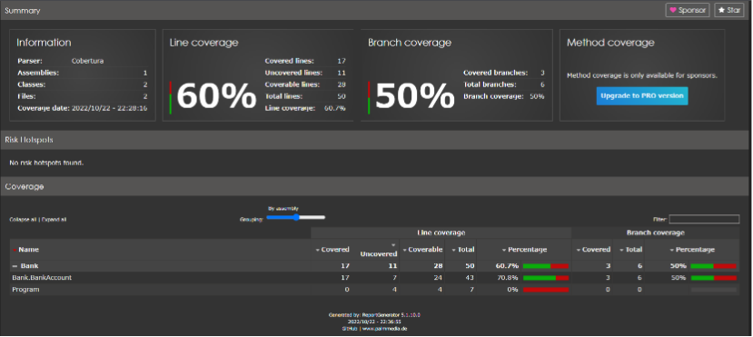
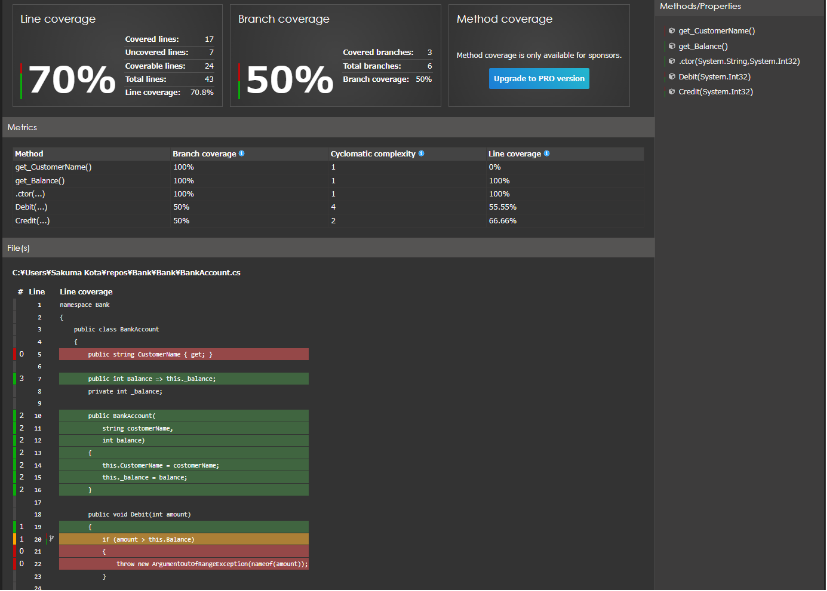

# 概要
C#のコードカバレッジを計測する方法を説明します。


# 前提
- Visual Studio 2022
- .NET 6
- xUnit
- [C#ユニットテスト](20221011204012.md)を実施済み


# コードカバレッジツール
役割が異なる2種類のツールを使います。

1. データコレクタ
2. レポートジェネレータ

## 1. データコレクタ
テスト実行を監視し、テスト実行に関する情報を収集します。

ここでは、[coverlet.collector](https://www.nuget.org/packages/coverlet.collector)を使用します。


## 2. レポートジェネレータ
データコレクタで、テストの実行から収集したデータを使用して、HTML形式等でレポートを作成します。

ここでは、[ReportGenerator](https://github.com/danielpalme/ReportGenerator)を使用します。


# データコレクタ設定
[C#ユニットテスト](20221011204012.md)で使用しているxUnitテストプロジェクトテンプレートは、既定で[coverlet.collector](https://www.nuget.org/packages/coverlet.collector)が設定されています。


# レポートジェネレータインストール
[ReportGenerator](https://github.com/danielpalme/ReportGenerator)をインストールします。.NETグローバルツールとしてインストールします。

- Powershellを開きます
- 下記コマンドを実行してインストールします

```powershell
dotnet tool install -g dotnet-reportgenerator-globaltool
```


# カバレッジ実行
1. [C#ユニットテスト](20221011204012.md)で作成したソリューションが存在するフォルダ(Bank)をPowershellで開きます。Bankフォルダの中身は下記のようになっています。

```powershell
$ ls -Name
Bank
Bank.Tests
Bank.sln
```

2. テストプロジェクトが存在するフォルダ(Bank.Tests)へ移動します。

```powershell
$ cd Bank.Tests

$ ls -Name
bin
obj
Bank.Tests.csproj
BankAccountTests.cs
Usings.cs

```

3. テストを実行します。データコレクタを実行するためのコマンドを追加して、テスト実行します。

```
$ dotnet test --collect:"XPlat Code Coverage"
```

TestResultsフォルダが生成され、データコレクタの実行結果**coverage.cobertura.xml**が格納されます。

```powershell
Bank.Tests\TestResults\{guid}\coverage.cobertura.xml
```

4. レポートを作成します。下記コマンドを実行します。

```powershell
$ reportgenerator -report:"TestResults\{guid}\coverage.cobertura.xml" -targetdir:"coveragereport" -reporttypes:Html
```

このコマンドを実行すると、HTMLファイルのレポートが生成されます。下記コマンドでHTMLファイルレポートを開きます。

```powershell
$ start coveragereport\index.html
```

下記のようなレポートで、カバレッジ結果を確認できます。



クラスを選択すると、カバレッジの詳細を確認できます。




# カバレッジ実行スクリプト
上記カバレッジ実行を自動化するスクリプト例を下記に示します。

```powershell
$dirs = Get-ChildItem -Path . -Recurse -Filter *TestResults*
foreach ($dir in $dirs)
{
    Remove-Item -Path $dir.FullName -Recurse -Force
}

dotnet test --collect:"XPlat Code Coverage"

$files = Get-ChildItem -Path . -Recurse -Filter *coverage.cobertura.xml
foreach ($file in $files)
{
    $reports = ("-reports:" + $file.FullName)
    $targetdir = ("-targetdir:" + $file.Directory.FullName + "\html")
    reportgenerator $reports  $targetdir -reporttypes:HTML
}
```


# 参考
- [単体テストにコードカバレッジを使用する](https://learn.microsoft.com/ja-jp/dotnet/core/testing/unit-testing-code-coverage?tabs=windows)
- [単体テストのコードカバレッジのレポートを生成する](https://tnakamura.hatenablog.com/entry/2022/05/20/unit-testing-code-coverage)
